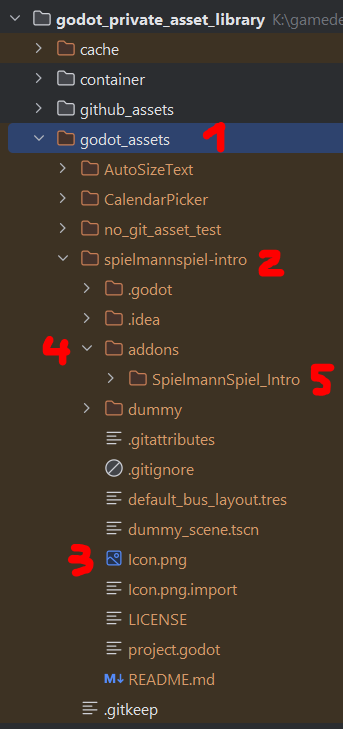
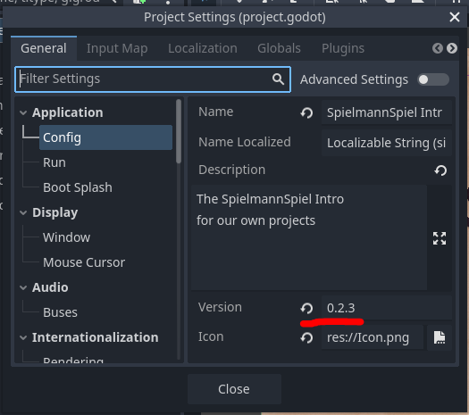

# Godot Private Asset Library

This is a local and private asset library for the Godot game eng
ine.  
It is a simple web application that allows you to host your own asset library on your machine.  
Clone/place your godot asset into the `godot_assets` folder, run the server and import them into your Godot project via the asset library.    


## Setup

* Clone the repository 
* Clone/place your Godot assets in the `godot_assets` folder
  * They should follow the [Godot Asset Library standards](https://docs.godotengine.org/en/stable/community/asset_library/submitting_to_assetlib.html) for best experience 
  * They don't have to be git-repositories and can be just plain folders, but should be for best experience
* Install / Run the server
  * [Locally](#Locally)
  * [With Docker](#Docker)
* Open your browser and navigate to http://127.0.0.1:8080 to validate all is running correctly
* Setup your Godot instance to use your local asset library
  * Open a/the project in Godot where you want the assets to be imported to
    * (the setting is global for all projects, but then you can use it instantly)
  * Go to `Editor -> Editor Settings -> General (tab) -> Asset Library -> Available Urls -> Dictionary`
    * `New Key`: `Library Name` (e.g. `Local Asset Library`)
    * `New Value`: `Library URL` (e.g. `http://127.0.0.1:8080/api`)


### Locally

* Optionally create a virtual environment with `python -m venv .venv`
  * Activate the virtual environment with
    * `source .venv/bin/activate` (Mac/Linux) 
    * or `.\venv\Scripts\activate` (Windows)
* Install the requirements with `pip install -r requirements.txt`
* Run the server with `uvicorn main:app --port 8080`

Development: `uvicorn main:app --port 8080 --reload`

#### Config

While you can look up configurable settings in the `config.py` file, please do not change the `config.py`.  
Use the `.env` as a parameter for uvicorn or environment variables to change the default settings.  

#### Changing HOST / Port

To change host/port you have to
* use the uvicorn port parameter
* use an .env file for FastApi

Examples:
```bash
uvicorn main:app --port 8082 --env-file=.env
```
```bash
uvicorn main:app --host 192.168.1.1 --port 8082 --env-file=.env
```

You have to write the host/port into the `.env` file, upper/lowercase is unimportant.  
`HOST` is `domain` in the config/.env, since it is just part of the url.  
You can look up all configurable settings for the `.env` file in the `config.py` file.

Example:

```dotenv
PORT=8082
app_name="APP name from env"
domain="192.168.1.1"
```

### Docker

Run from Docker Hub
```bash
docker compose up
```

Run/build locally
```bash
docker compose -f docker-compose-local.yml up
```
Rebuild local container
```bash
docker compose -f docker-compose-local.yml build godot_private_asset_library
```

### Docker Compose

To not go through the whole Docker Compose documentation https://docs.docker.com/compose/ and without complex compose-file-chaining and overriding, here is an example Docker Compose file on how to override the settings.  
File name (it is also git-ignored): `Docker-compose-private.yml`  
Use the usual docker-compose commands just with this file name `docker compose -f Docker-compose-private.yml up`.  

```yaml
version: "3.9"

services:
  godot_private_asset_library:
    container_name: godot_private_asset_library
    # if you want to use this file to build the image
    build:
      context: .
      dockerfile: container/Dockerfile
    environment:
      # the environment variables are used for the uvicorn webserver
      - PORT=8081
    volumes:
      - ./godot_assets:/app/godot_assets
      - ./cache/:/app/cache
      # the .env file is used for the application inside the container
      - .env:/app/.env
    ports:
      - "8081:8081"
```

## WARNING

This was **NEVER MEANT** to be run on the open Internet. It has no access control whatsoever.  
It is build to run either on your local machine or your private Network.  
Running it exposed to the Internet is your responsibility to make it secure!

## Create a Godot asset

As mentioned earlier, you should follow the [Godot Asset Library standards](https://docs.godotengine.org/en/stable/community/asset_library/submitting_to_assetlib.html) for the best experience when creating an Godot asset.  
The following is how you integrate/place it into the Godot Private Asset Library to be used.  

1. The `godot_asset` folder. It is excluded from Git and you can clone/copy your/other peoples Godot assets right into this folder.
   * The asset does not have to be a Git-repository (it probably should be). A "normal" Godot project works just fine.
   * You can even create a new Godot project inside the `godot_asset` folder and work there (you probably shouldn't).
2. An example for one of our own assets, it is a cloned Git-repository from a private GitLab server.
3. The used icon for the project in the Godot-Asset-Library browser.
   * Has to be placed in the root-folder of the project.
   * File names `Icon` / `icon` are supported.
   * File types `".png", ".jpg", ".jpeg", ".gif", ".webp", ".svg"` are supported (but only png is tested (currently)).
   * The first icon name-extension combination found will be used.
   * If no icon is found, the default godot icon will be used.
4. When creating a normal Godot asset, the actual code that people import should be in a sub-folder called `addons`
5. The actual part of the project that ends up in peoples Godot project is the folder inside the `addons` folder.


### Version Number
The Version number shown in the Godot asset library will be read from Git-Tags AND from the Godot project version you put in the Godot project settings.  
If both numbers are present, Both will be shown.  


## Licenses & Credits

* Loading Spinner: https://pixabay.com/gifs/load-loading-process-wait-delay-37/

## links

* cross-link [GitHub](https://github.com/SpielmannSpiel/Godot-Private-Asset-Library) / [DockerHub](https://hub.docker.com/r/generalbison/godot_private_asset_library)
* Godot assets formats: https://docs.godotengine.org/en/stable/community/asset_library/submitting_to_assetlib.html
* Godot asset library API: https://github.com/godotengine/godot-asset-library/blob/master/API.md#api-get-configure
* Inspiration: https://github.com/christinoleo/godot-custom-assetlib/tree/master / https://github.com/christinoleo/godot-custom-assetlib/tree/master/backend
* Local Documentation: http://127.0.0.1:8080/docs
